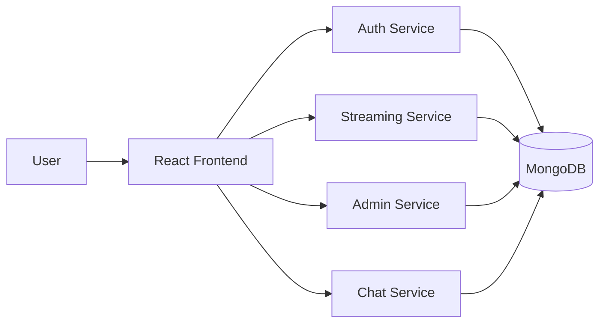

AWS Credentials

CLIENT_URLS=http://localhost:3000
JWT_SECRET=changeme
MONGO_DB=streamingapp
AWS_ACCESS_KEY_ID=
AWS_SECRET_ACCESS_KEY=
AWS_REGION=ap-south-1
AWS_S3_BUCKET=
AWS_CDN_URL=
AUTH_PORT=3001
STREAMING_PORT=3002
ADMIN_PORT=3003
CHAT_PORT=3004
STREAMING_PUBLIC_URL=http://localhost:3002
REACT_APP_AUTH_API_URL=http://localhost:3001/api
REACT_APP_STREAMING_API_URL=http://localhost:3002/api
REACT_APP_STREAMING_PUBLIC_URL=http://localhost:3002
REACT_APP_ADMIN_API_URL=http://localhost:3003/api/admin
REACT_APP_CHAT_API_URL=http://localhost:3004/api/chat
REACT_APP_CHAT_SOCKET_URL=http://localhost:3004


# Shared
CLIENT_URLS=http://localhost:3000
JWT_SECRET=changeme
MONGO_DB=streamingapp

Helm

Deployment.yml

apiVersion: apps/v1
kind: Deployment
metadata:
  name: {{ .Release.Name }}-mongodb
spec:
  replicas: 1
  selector:
    matchLabels:
      app: {{ .Release.Name }}-mongodb
  template:
    metadata:
      labels:
        app: {{ .Release.Name }}-mongodb
    spec:
      containers:
        - name: mongodb
          image: {{ .Values.mongodb.image }}
          ports:
            - containerPort: {{ .Values.mongodb.port }}
---
apiVersion: apps/v1
kind: Deployment
metadata:
  name: {{ .Release.Name }}-frontend
spec:
  replicas: 1
  selector:
    matchLabels:
      app: {{ .Release.Name }}-frontend
  template:
    metadata:
      labels:
        app: {{ .Release.Name }}-frontend
    spec:
      containers:
        - name: frontend
          image: "{{ .Values.frontend.image.repository }}:{{ .Values.frontend.image.tag }}"
          imagePullPolicy: {{ .Values.image.pullPolicy }}
          ports:
            - containerPort: 80
---
apiVersion: apps/v1
kind: Deployment
metadata:
  name: {{ .Release.Name }}-auth
spec:
  replicas: 1
  selector:
    matchLabels:
      app: {{ .Release.Name }}-auth
  template:
    metadata:
      labels:
        app: {{ .Release.Name }}-auth
    spec:
      containers:
        - name: auth
          image: "{{ .Values.auth.image.repository }}:{{ .Values.auth.image.tag }}"
          imagePullPolicy: {{ .Values.image.pullPolicy }}
          env:
            - name: PORT
              value: "3001"
            - name: MONGO_URI
              value: mongodb://{{ .Release.Name }}-mongodb:27017/streamingapp
          ports:
            - containerPort: 3001
---
apiVersion: apps/v1
kind: Deployment
metadata:
  name: {{ .Release.Name }}-streaming
spec:
  replicas: 1
  selector:
    matchLabels:
      app: {{ .Release.Name }}-streaming
  template:
    metadata:
      labels:
        app: {{ .Release.Name }}-streaming
    spec:
      containers:
        - name: streaming
          image: "{{ .Values.streaming.image.repository }}:{{ .Values.streaming.image.tag }}"
          imagePullPolicy: {{ .Values.image.pullPolicy }}
          env:
            - name: PORT
              value: "3002"
            - name: MONGO_URI
              value: mongodb://{{ .Release.Name }}-mongodb:27017/streamingapp
          ports:
            - containerPort: 3002
---
apiVersion: apps/v1
kind: Deployment
metadata:
  name: {{ .Release.Name }}-admin
spec:
  replicas: 1
  selector:
    matchLabels:
      app: {{ .Release.Name }}-admin
  template:
    metadata:
      labels:
        app: {{ .Release.Name }}-admin
    spec:
      containers:
        - name: admin
          image: "{{ .Values.admin.image.repository }}:{{ .Values.admin.image.tag }}"
          imagePullPolicy: {{ .Values.image.pullPolicy }}
          env:
            - name: PORT
              value: "3003"
            - name: MONGO_URI
              value: mongodb://{{ .Release.Name }}-mongodb:27017/streamingapp
          ports:
            - containerPort: 3003
---
apiVersion: apps/v1
kind: Deployment
metadata:
  name: {{ .Release.Name }}-chat
spec:
  replicas: 1
  selector:
    matchLabels:
      app: {{ .Release.Name }}-chat
  template:
    metadata:
      labels:
        app: {{ .Release.Name }}-chat
    spec:
      containers:
        - name: chat
          image: "{{ .Values.chat.image.repository }}:{{ .Values.chat.image.tag }}"
          imagePullPolicy: {{ .Values.image.pullPolicy }}
          env:
            - name: PORT
              value: "3004"
            - name: MONGO_URI
              value: mongodb://{{ .Release.Name }}-mongodb:27017/streamingapp
          ports:
            - containerPort: 3004
Service.yaml

apiVersion: v1
kind: Service
metadata:
  name: {{ .Release.Name }}-mongodb
spec:
  selector:
    app: {{ .Release.Name }}-mongodb
  ports:
    - port: {{ .Values.mongodb.port }}
      targetPort: {{ .Values.mongodb.port }}
---
apiVersion: v1
kind: Service
metadata:
  name: {{ .Release.Name }}-frontend
spec:
  type: {{ .Values.service.type }}
  selector:
    app: {{ .Release.Name }}-frontend
  ports:
    - port: {{ .Values.frontend.service.port }}
      targetPort: 80
---
apiVersion: v1
kind: Service
metadata:
  name: {{ .Release.Name }}-auth
spec:
  selector:
    app: {{ .Release.Name }}-auth
  ports:
    - port: {{ .Values.auth.service.port }}
      targetPort: 3001
---
apiVersion: v1
kind: Service
metadata:
  name: {{ .Release.Name }}-streaming
spec:
  selector:
    app: {{ .Release.Name }}-streaming
  ports:
    - port: {{ .Values.streaming.service.port }}
      targetPort: 3002
---
apiVersion: v1
kind: Service
metadata:
  name: {{ .Release.Name }}-admin
spec:
  selector:
    app: {{ .Release.Name }}-admin
  ports:
    - port: {{ .Values.admin.service.port }}
      targetPort: 3003
---
apiVersion: v1
kind: Service
metadata:
  name: {{ .Release.Name }}-chat
spec:
  selector:
    app: {{ .Release.Name }}-chat
  ports:
    - port: {{ .Values.chat.service.port }}
      targetPort: 3004

chart.yml

apiVersion: v2
name: streamingapp
description: Helm chart for the StreamingApp microservices stack
version: 0.1.0
appVersion: "1.0"


values.yml

replicaCount: 1

image:
  repository: nginx
  tag: latest
  pullPolicy: IfNotPresent

service:
  type: ClusterIP
  port: 80

mongodb:
  image: mongo:6
  port: 27017

frontend:
  image:
    repository: streaming-frontend
    tag: latest
  service:
    port: 80

auth:
  image:
    repository: streaming-auth
    tag: latest
  service:
    port: 3001

streaming:
  image:
    repository: streaming-streaming
    tag: latest
  service:
    port: 3002

admin:
  image:
    repository: streaming-admin
    tag: latest
  service:
    port: 3003

chat:
  image:
    repository: streaming-chat
    tag: latest
  service:
    port: 3004

deployment.md

 
# Deployment Guide

## Overview
This project is prepared for local Docker Compose testing and for production-style deployment on Amazon ECR, Jenkins, and Kubernetes (EKS) using Helm.

## Architecture


## 1. Local Development with Docker Compose
```bash
cp .env.example .env
docker compose up --build
```
Then open http://localhost:3000.

## 2. Build and Push Images to Amazon ECR
```bash
aws configure
aws ecr create-repository --repository-name streaming-auth
aws ecr create-repository --repository-name streaming-streaming
aws ecr create-repository --repository-name streaming-admin
aws ecr create-repository --repository-name streaming-chat
aws ecr create-repository --repository-name streaming-frontend

aws ecr get-login-password --region us-east-1 | docker login --username AWS --password-stdin <ACCOUNT_ID>.dkr.ecr.us-east-1.amazonaws.com

docker build -t streaming-auth:latest ./backend/authService
docker tag streaming-auth:latest <ACCOUNT_ID>.dkr.ecr.us-east-1.amazonaws.com/streaming-auth:latest
docker push <ACCOUNT_ID>.dkr.ecr.us-east-1.amazonaws.com/streaming-auth:latest
```
Repeat the same pattern for the other services and the frontend image.

## 3. Jenkins Pipeline
The repository includes a Jenkinsfile that:
- checks out the source code,
- builds the Docker images,
- signs into Amazon ECR,
- publishes the images to ECR.

## 4. Kubernetes / EKS Deployment with Helm
```bash
eksctl create cluster --name streaming-cluster --region us-east-1 --nodes 2
helm upgrade --install streamingapp ./helm/streamingapp
kubectl get pods,svc
```
If you want to expose the frontend externally, update the chart values or add an ingress.

## 5. Monitoring and Logging
- Use CloudWatch for metrics and alarms.
- Use `kubectl logs <pod-name>` for pod logs.
- Use `kubectl describe deployment <name>` when troubleshooting rollout issues.

## 6. Suggested Production Architecture
- Frontend: React app served by Nginx
- Backend services: auth, streaming, admin, chat
- Database: MongoDB
- Container registry: Amazon ECR
- CI/CD: Jenkins
- Deployment: EKS + Helm

Jenkins BUild
 

 

# Frontend build-time values
REACT_APP_AUTH_API_URL=http://localhost:3001/api
REACT_APP_STREAMING_API_URL=http://localhost:3002/api
REACT_APP_STREAMING_PUBLIC_URL=http://localhost:3002
REACT_APP_ADMIN_API_URL=http://localhost:3003/api/admin
REACT_APP_CHAT_API_URL=http://localhost:3004/api/chat
REACT_APP_CHAT_SOCKET_URL=http://localhost:3004


Docker-compose.yml
version: "3.9"

services:
  mongo:
    image: mongo:6
    restart: unless-stopped
    ports:
      - "27017:27017"
    volumes:
      - mongo-data:/data/db

  auth:
    build:
      context: ./backend/authService
    depends_on:
      - mongo
    environment:
      PORT: 3001
      MONGO_URI: mongodb://mongo:27017/${MONGO_DB:-streamingapp}
      JWT_SECRET: ${JWT_SECRET:-changeme}
      CLIENT_URLS: ${CLIENT_URLS:-http://localhost:3000}
      AWS_ACCESS_KEY_ID: ${AWS_ACCESS_KEY_ID:-}
      AWS_SECRET_ACCESS_KEY: ${AWS_SECRET_ACCESS_KEY:-}
      AWS_REGION: ${AWS_REGION:-ap-south-1}
      AWS_S3_BUCKET: ${AWS_S3_BUCKET:-}
    ports:
      - "${AUTH_PORT:-3001}:3001"

  streaming:
    build:
      context: ./backend/streamingService
    depends_on:
      - mongo
    environment:
      PORT: 3002
      MONGO_URI: mongodb://mongo:27017/${MONGO_DB:-streamingapp}
      JWT_SECRET: ${JWT_SECRET:-changeme}
      CLIENT_URLS: ${CLIENT_URLS:-http://localhost:3000}
      AWS_ACCESS_KEY_ID: ${AWS_ACCESS_KEY_ID:-}
      AWS_SECRET_ACCESS_KEY: ${AWS_SECRET_ACCESS_KEY:-}
      AWS_REGION: ${AWS_REGION:-ap-south-1}
      AWS_S3_BUCKET: ${AWS_S3_BUCKET:-}
      AWS_CDN_URL: ${AWS_CDN_URL:-}
      STREAMING_PUBLIC_URL: ${STREAMING_PUBLIC_URL:-http://localhost:3002}
    ports:
      - "${STREAMING_PORT:-3002}:3002"

  admin:
    build:
      context: ./backend/adminService
    depends_on:
      - mongo
    environment:
      PORT: 3003
      MONGO_URI: mongodb://mongo:27017/${MONGO_DB:-streamingapp}
      JWT_SECRET: ${JWT_SECRET:-changeme}
      CLIENT_URLS: ${CLIENT_URLS:-http://localhost:3000}
      AWS_ACCESS_KEY_ID: ${AWS_ACCESS_KEY_ID:-}
      AWS_SECRET_ACCESS_KEY: ${AWS_SECRET_ACCESS_KEY:-}
      AWS_REGION: ${AWS_REGION:-ap-south-1}
      AWS_S3_BUCKET: ${AWS_S3_BUCKET:-}
      AWS_CDN_URL: ${AWS_CDN_URL:-}
    ports:
      - "${ADMIN_PORT:-3003}:3003"

  chat:
    build:
      context: ./backend/chatService
    depends_on:
      - mongo
    environment:
      PORT: 3004
      MONGO_URI: mongodb://mongo:27017/${MONGO_DB:-streamingapp}
      JWT_SECRET: ${JWT_SECRET:-changeme}
      CLIENT_URLS: ${CLIENT_URLS:-http://localhost:3000}
    ports:
      - "${CHAT_PORT:-3004}:3004"

  frontend:
    build:
      context: ./frontend
      args:
        REACT_APP_AUTH_API_URL: ${REACT_APP_AUTH_API_URL:-http://localhost:3001/api}
        REACT_APP_STREAMING_API_URL: ${REACT_APP_STREAMING_API_URL:-http://localhost:3002/api}
        REACT_APP_STREAMING_PUBLIC_URL: ${REACT_APP_STREAMING_PUBLIC_URL:-http://localhost:3002}
        REACT_APP_ADMIN_API_URL: ${REACT_APP_ADMIN_API_URL:-http://localhost:3003/api/admin}
        REACT_APP_CHAT_API_URL: ${REACT_APP_CHAT_API_URL:-http://localhost:3004/api/chat}
        REACT_APP_CHAT_SOCKET_URL: ${REACT_APP_CHAT_SOCKET_URL:-http://localhost:3004}
    depends_on:
      - auth
      - streaming
      - admin
      - chat
    ports:
      - "3000:80"

volumes:
  mongo-data:


Jenkins File

pipeline {
  agent any
  environment {
    AWS_REGION = 'us-east-1'
    ECR_REGISTRY = '506189153515.dkr.ecr.us-east-1.amazonaws.com'
  }
  stages {
    stage('Checkout') {
      steps {
        checkout([$class: 'GitSCM', branches: [[name: '*/main']], userRemoteConfigs: [[url: 'https://github.com/UnpredictablePrashant/StreamingApp.git']]])
      }
    }

    stage('Build Frontend') {
      steps {
        dir('frontend') {
          sh 'docker build -t frontend:latest .'
        }
      }
    }

    stage('Build Backend Services') {
      steps {
        dir('backend/authService') { sh 'docker build -t backend-auth:latest .' }
        dir('backend/streamingService') { sh 'docker build -t backend-streaming:latest .' }
        dir('backend/adminService') { sh 'docker build -t backend-admin:latest .' }
        dir('backend/chatService') { sh 'docker build -t backend-chat:latest .' }
      }
    }

    stage('Login to ECR') {
      steps {
        // Use the official AWS CLI Docker image to generate ECR login password
        withCredentials([usernamePassword(credentialsId: 'aws-creds', usernameVariable: 'AWS_ACCESS_KEY_ID', passwordVariable: 'AWS_SECRET_ACCESS_KEY')]) {
          sh '''
          docker run --rm -e AWS_ACCESS_KEY_ID=$AWS_ACCESS_KEY_ID -e AWS_SECRET_ACCESS_KEY=$AWS_SECRET_ACCESS_KEY \
            amazon/aws-cli:2.11.4 ecr get-login-password --region $AWS_REGION | \
            docker login --username AWS --password-stdin $ECR_REGISTRY
          '''
        }
      }
    }

    stage('Tag & Push') {
      steps {
        sh "docker tag frontend:latest ${ECR_REGISTRY}/frontend:latest"
        sh "docker push ${ECR_REGISTRY}/frontend:latest"

        sh "docker tag backend-auth:latest ${ECR_REGISTRY}/backend-auth:latest"
        sh "docker push ${ECR_REGISTRY}/backend-auth:latest"

        sh "docker tag backend-streaming:latest ${ECR_REGISTRY}/backend-streaming:latest"
        sh "docker push ${ECR_REGISTRY}/backend-streaming:latest"

        sh "docker tag backend-admin:latest ${ECR_REGISTRY}/backend-admin:latest"
        sh "docker push ${ECR_REGISTRY}/backend-admin:latest"

        sh "docker tag backend-chat:latest ${ECR_REGISTRY}/backend-chat:latest"
        sh "docker push ${ECR_REGISTRY}/backend-chat:latest"
      }
    }
  }
  post {
    always {
      sh 'docker image prune -f || true'
    }
  }
}


 
 

 

 

 
 
 
