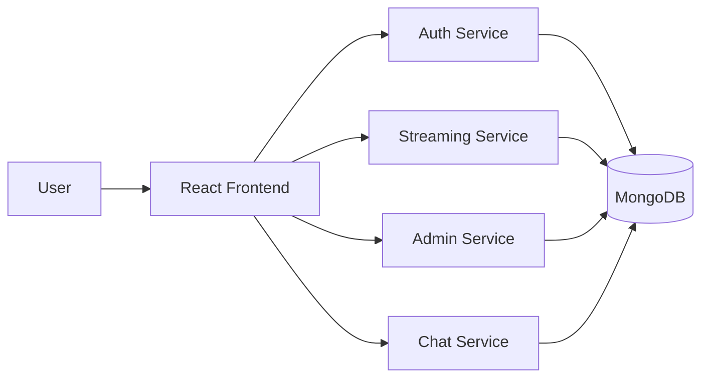

# Deployment Guide

## Overview
This project is prepared for local Docker Compose testing and for production-style deployment on Amazon ECR, Jenkins, and Kubernetes (EKS) using Helm.

## Architecture


## 1. Local Development with Docker Compose
```bash
cp .env.example .env
docker compose up --build
```
Then open http://localhost:3000.

## 2. Build and Push Images to Amazon ECR
```bash
aws configure
aws ecr create-repository --repository-name streaming-auth
aws ecr create-repository --repository-name streaming-streaming
aws ecr create-repository --repository-name streaming-admin
aws ecr create-repository --repository-name streaming-chat
aws ecr create-repository --repository-name streaming-frontend

aws ecr get-login-password --region us-east-1 | docker login --username AWS --password-stdin <ACCOUNT_ID>.dkr.ecr.us-east-1.amazonaws.com

docker build -t streaming-auth:latest ./backend/authService
docker tag streaming-auth:latest <ACCOUNT_ID>.dkr.ecr.us-east-1.amazonaws.com/streaming-auth:latest
docker push <ACCOUNT_ID>.dkr.ecr.us-east-1.amazonaws.com/streaming-auth:latest
```
Repeat the same pattern for the other services and the frontend image.

## 3. Jenkins Pipeline
The repository includes a Jenkinsfile that:
- checks out the source code,
- builds the Docker images,
- signs into Amazon ECR,
- publishes the images to ECR.

## 4. Kubernetes / EKS Deployment with Helm
```bash
eksctl create cluster --name streaming-cluster --region us-east-1 --nodes 2
helm upgrade --install streamingapp ./helm/streamingapp
kubectl get pods,svc
```
If you want to expose the frontend externally, update the chart values or add an ingress.

## 5. Monitoring and Logging
- Use CloudWatch for metrics and alarms.
- Use `kubectl logs <pod-name>` for pod logs.
- Use `kubectl describe deployment <name>` when troubleshooting rollout issues.

## 6. Suggested Production Architecture
- Frontend: React app served by Nginx
- Backend services: auth, streaming, admin, chat
- Database: MongoDB
- Container registry: Amazon ECR
- CI/CD: Jenkins
- Deployment: EKS + Helm
